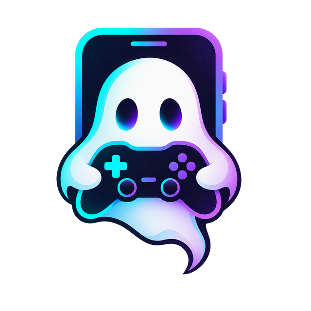
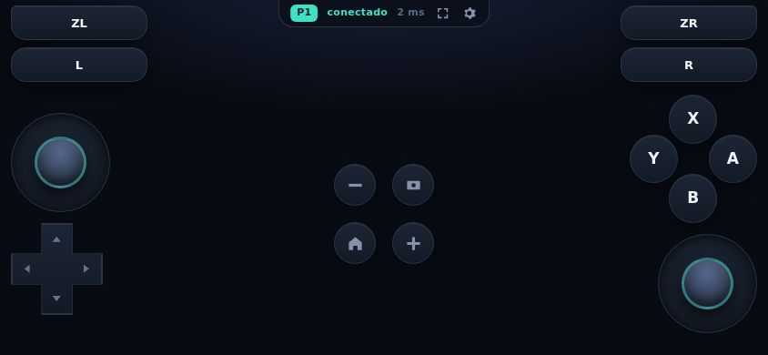

<p align="center">
  
</p>

<h1 align="center">GhostPad</h1>

<p align="center">
  <strong>Tu teléfono es el mando. El PC ve un Xbox de verdad.</strong>
</p>

<p align="center">
  <a href="https://github.com/tanoriruizs/ghostpad/actions/workflows/ci.yml"></a>
  
  
  
  
</p>

<p align="center">
  
</p>

Escanea un código QR con cualquier teléfono y se convierte en un mando de Xbox
360 completo para tu PC con Windows. **Sin instalar apps, sin emparejar
Bluetooth, sin crear cuentas.** Funciona con cualquier juego o emulador que
acepte un mando de Xbox — Steam, Yuzu/Eden, Ryujinx, Dolphin, RetroArch, PCSX2,
Cemu — y admite varios jugadores a la vez.

```
📱 Teléfono (navegador) ──WebSocket──▶ 🖥️ server.py ──ViGEmBus──▶ 🎮 Mando Xbox 360 virtual ──▶ Juego
```

### ¿Por qué "Ghost"?

Porque el mando no está ahí de verdad. Windows y el juego ven un Xbox 360 físico
conectado — botones, sticks analógicos, gatillos, hasta vibración — pero lo que
realmente lo mueve es una página web en un teléfono al otro lado del sillón.

Nació de una necesidad concreta: querer jugar Mario Kart a dos en un emulador y
tener un solo mando. Las alternativas eran comprar otro o instalar apps de
terceros en cada teléfono, con sus anuncios, sus permisos y sus registros.
GhostPad es la respuesta: **un mando que se usa desde el navegador, sin instalar
nada en el teléfono.** Cualquier visita entra en diez segundos con su propio
teléfono, y cuando se va no queda nada instalado.

### Empezar

```bat
git clone https://github.com/tanoriruizs/ghostpad.git
cd ghostpad
start.bat
```

1. Instala [ViGEmBus](https://github.com/nefarius/ViGEmBus/releases) una vez y
   reinicia (es el driver que crea los mandos virtuales).
2. Ejecuta `start.bat`. La primera vez prepara un entorno virtual; después
   muestra el logo, la dirección, el PIN de acceso y un código QR.
3. Escanea el QR con cada teléfono, toca **Continuar**, y ya eres `P1`, `P2`…
4. En el juego, cada teléfono aparece como un *Xbox 360 Controller*.

Si el firewall de Windows bloquea el puerto, ejecuta `abrir-firewall.bat` **como
administrador** una sola vez.

### Características

| | |
|---|---|
| 🎮 **Pro Controller completo** | ABXY, cruceta con diagonales, dos sticks analógicos con clic (L3/R3), L/R/ZL/ZR, +/−, Home, captura |
| 👥 **Multijugador** | Un mando virtual por teléfono — 2 por defecto, hasta 4 con `--players 4` |
| 🔐 **PIN de acceso** | 4 dígitos aleatorios por sesión, incluidos en el QR para que entrar sea un escaneo. `--pin off` lo desactiva |
| 📳 **Vibración real** | El rumble que el juego envía al mando llega al teléfono, con fuerza ajustable |
| 🔆 **Pantalla siempre encendida** | Sin HTTPS — Wake Lock con respaldo de vídeo mudo |
| 🔄 **Se orienta solo** | Ábrelo en vertical o vuelve de otra app: un toque lo pone en horizontal + pantalla completa |
| ⚡ **Baja latencia** | Solo se envían los cambios; 5–15 ms en Wi-Fi de 5 GHz. Ping en la barra superior |
| 🎯 **Toque tolerante** | Cada botón tiene un área invisible ampliada; un dedo algo descolocado cuenta igual |
| 🔁 **Robusto** | Reconexión automática, botones liberados al cambiar de app, ajustes por teléfono |
| 🌐 **Interfaz bilingüe** | Español e inglés, cambiable en ajustes |
| 📲 **Instalable** | "Añadir a pantalla de inicio" lo abre a pantalla completa en horizontal, como una app |
| 🔒 **Privado** | Sin cuentas, sin nube, sin telemetría. Un servidor de un archivo que solo escucha en tu red local |

### Compatibilidad

| | Estado | Notas |
|---|---|---|
| **PC con Windows 10 / 11 (64 bits)** | ✅ Soportado | Necesita [ViGEmBus](https://github.com/nefarius/ViGEmBus/releases) |
| **PC con Linux / macOS** | ❌ Aún no | Haría falta un backend `uinput` / HID virtual — se aceptan contribuciones |
| **Android — Chrome, Firefox, Samsung Internet** | ✅ Completo | Vibración, pantalla completa y giro automático funcionan |
| **iPhone / iPad — Safari** | ⚠️ Parcial | Los controles funcionan; **sin vibración**, **sin giro/pantalla completa automáticos** (restricciones de iOS) |
| **Navegador de escritorio** (pruebas) | ✅ Funciona | El ratón actúa como un solo dedo |
| **Python** | 3.10+ | |

> **¿No vibra en Android?** Abre ⚙ → *Probar*. Si dice que envió el pulso y no
> sientes nada, el teléfono tiene la vibración táctil apagada a nivel de sistema
> (ajustes de Sonido y vibración) o está en Silencio — actívala y pon la *Fuerza
> de la vibración* en **Fuerte**.

### Opciones del servidor

```bat
.venv\Scripts\python server.py --players 4 --port 8080 --pin off
```

| Opción | Descripción | Por defecto |
|---|---|---|
| `--players N` | Mandos virtuales creados al arrancar | 2 |
| `--port N` | Puerto HTTP/WebSocket | 8000 |
| `--host IP` | Interfaz de escucha | 0.0.0.0 |
| `--pin auto\|off\|1234` | PIN de acceso: aleatorio, desactivado o fijo | auto |
| `--verbose` | Log detallado | off |
| `--version` | Muestra la versión y sale | |

### Ajustes en el teléfono (⚙)

| Opción | Para qué sirve |
|---|---|
| Idioma | Español (por defecto) o inglés, se guarda en el teléfono |
| Sensibilidad del stick izquierdo | Más alto = llega al tope con menos recorrido |
| Zona muerta | Súbela si el personaje se mueve solo |
| Tamaño de los botones | Adáptalo a tu pantalla y a tu mano |
| Vibración + Probar | Feedback al pulsar y rumble del juego; la prueba diagnostica por qué podría no vibrar |
| Fuerza de la vibración | Suave / Media / Fuerte — muchos motores Android necesitan Fuerte para notarse |
| Mapeo A/B/X/Y | *Por posición* (Xbox) o *por etiqueta* (Nintendo) |
| Stick derecho | Ocúltalo si estorba |

Para forzar un jugador concreto, añade `?slot=2` a la dirección.

### Cómo funciona

```
ghostpad/
├─ server.py        servidor aiohttp: sirve la página, un WebSocket por jugador,
│                   comprueba el PIN, valida frames y reenvía el rumble
├─ gamepad.py       envoltorio de vgamepad (ViGEmBus): un VX360Gamepad por slot,
│                   mapeo Switch → Xbox y callback de vibración
├─ protocol.py      formato del frame y validación — todo lo que llega por la red
│                   se acota antes de tocar el driver
├─ web/             el mando: index.html · style.css · app.js · iconos · manifest
├─ tests/           suite pytest (protocolo, mapeo, servidor de punta a punta)
└─ .github/         CI en cada push
```

La página sigue cada dedo con Pointer Events y serializa cada cambio de estado
como un JSON de ~80 bytes por WebSocket:

```json
{"b": 18, "lx": -0.42, "ly": 0.0, "rx": 0.0, "ry": 0.0, "zl": 0.0, "zr": 1.0}
```

`b` es una máscara de bits (ver `protocol.py::Button`), los sticks van en
`[-1, 1]` y los gatillos en `[0, 1]`. El servidor responde `{"type":"ping"}` con
`pong`, acepta `{"type":"config","layout":…}`, y envía `rumble` (`l`, `s` en
0–255) y `assigned` / `rejected` (`reason`: `pin` | `full`). El PIN viaja en la
query del WebSocket.

### Desarrollo

```bat
pip install -r requirements-dev.txt
pytest
```

Los tests sustituyen `vgamepad` por un doble, así que corren en cualquier sistema
— incluida la CI de GitHub Actions, que además comprueba que el JavaScript del
cliente parsea.

### Problemas frecuentes

| Síntoma | Solución |
|---|---|
| *"No se pudo crear el gamepad virtual"* | ViGEmBus no está instalado o falta reiniciar |
| El teléfono no carga la página | Otra red (invitados, datos móviles); Wi-Fi marcada *Pública* en Windows (cámbiala a *Privada* o ejecuta `abrir-firewall.bat` como admin); antivirus bloqueando el puerto |
| *"Este mando pide un PIN"* | Escribe el PIN de la consola del PC, o escanea el QR, que ya lo incluye |
| El juego solo ve un mando | El segundo teléfono aún no ha entrado, o el juego se abrió antes que el servidor. Conecta y reinicia el juego |
| Se siente con retraso | Usa Wi-Fi de 5 GHz; mira el ping en la barra superior (verde < 45 ms, ámbar < 90 ms) |
| No vibra | iPhone: Safari no lo soporta. Android: ⚙ → *Probar* te dice si el navegador la bloqueó o si la háptica del teléfono está apagada |
| No se gira solo en iPhone | iOS no lo permite a las webs; GhostPad te pide girarlo a mano y funciona igual |

### Seguridad

El servidor solo escucha en tu red local. El PIN evita que cualquiera de tu Wi-Fi
tome un mando libre, pero no es cifrado: no expongas el puerto a Internet ni lo
uses en redes públicas.

### Hoja de ruta

Ideas bienvenidas como issues o pull requests: PC con Linux vía `uinput`, giro
por giroscopio sobre HTTPS, layouts por juego, un DualShock virtual además del
Xbox.

### Licencia

MIT — ver [LICENSE](LICENSE).
